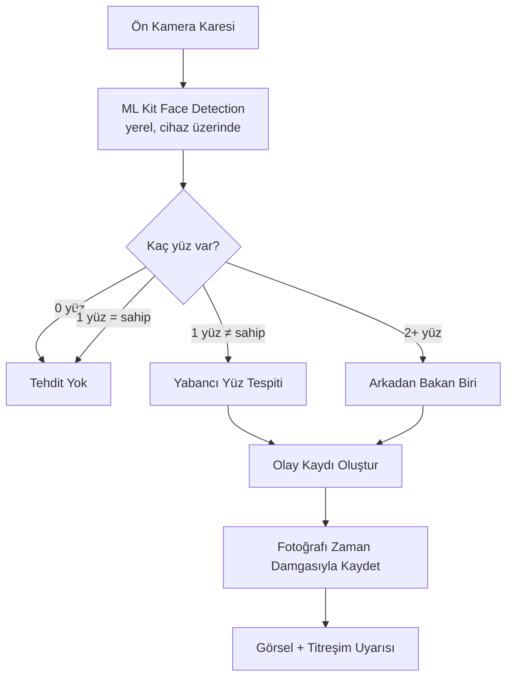
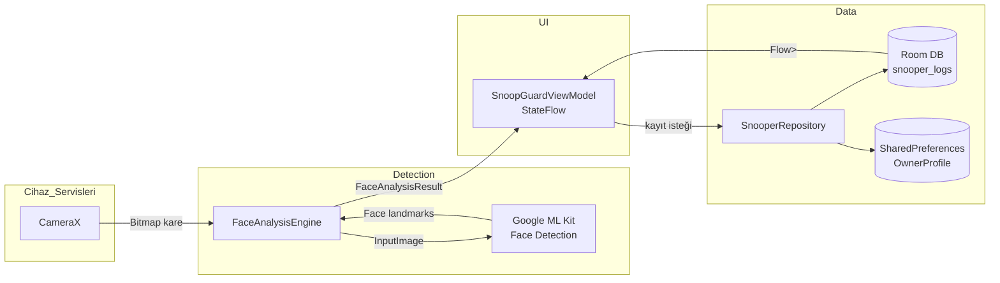

<div align="center">

# 🛡️ SnoopGuard

**Ekranınız Yalnızca Sizin Gözleriniz İçin**

On-cihaz gizlilik koruması — omuz sörfüne ve cihaz gözetlemesine karşı yerel yüz analizi.

[](https://github.com/EthYusuf/snoopguard/blob/main/LICENSE)
[](#technical-specifications--teknik-özellikler)
[](#technical-specifications--teknik-özellikler)

</div>

---

## Amaç

SnoopGuard, ön kamerayı kullanarak ekrana kimin baktığını **yerel olarak** analiz eden bir Android gizlilik uygulamasıdır. Kayıtlı cihaz sahibini tanır; yabancı bir yüz veya arkadan bakan ikinci bir kişi tespit ettiğinde uyarır ve kanıt fotoğrafını cihazda saklar. Amaç, şifreleme veya kilit ekranının yerine geçmek değil, bu mekanizmaların kapsamadığı **"cihazım açıkken kim ekranıma bakıyor?"** sorusuna pratik bir yanıt vermektir.

## Hızlı Başlangıç

**Kurulum:**
```bash
git clone https://github.com/EthYusuf/snoopguard.git
cd snoopguard
./gradlew assembleDebug
```
APK: `app/build/outputs/apk/debug/`. Hazır paket için [Releases](https://github.com/EthYusuf/snoopguard/releases) sayfasına bakın.

**Kullanım:** Sahip yüzünüzü kaydedin → bir koruma modu seçin (Canlı Kalkan / Tuzak Ekranı / Gizli Gözcü) → duyarlılığı ayarlayın → tespit edilen olayları Forensic Gallery'den inceleyin. Ayrıntılı adımlar [Nasıl Çalışır](#nasıl-çalışır--how-it-works) ve [Key Features](#key-features--öne-çıkan-özellikler) bölümlerinde.

---

## İçindekiler

- [Key Features](#key-features--öne-çıkan-özellikler)
- [Nasıl Çalışır (How It Works)](#nasıl-çalışır--how-it-works)
- [Architecture Diagram](#architecture-diagram--mimari-akış)
- [Project Structure](#project-structure--proje-yapısı)
- [Technical Specifications](#technical-specifications--teknik-özellikler)
- [Permissions](#permissions--izinler)
- [Data Flow](#data-flow--veri-akışı)
- [Security & Privacy](#security--privacy--güvenlik-ve-gizlilik)
- [Testing](#testing--test)
- [Build Status / CI](#build-status--ci)
- [Release / Versioning](#release--versioning)
- [Roadmap](#roadmap)
- [Known Limitations](#known-limitations--bilinen-sınırlamalar)
- [Responsible Use](#responsible-use--sorumlu-kullanım)
- [Contributing](#contributing--katkıda-bulunma)
- [License](#license--lisans)
- [Acknowledgements](#acknowledgements--teşekkürler)
- [Author / Credits](#author--credits)
- [Repository Links](#repository-links)
- [FAQ](#faq--sık-sorulan-sorular)
- [Compatibility](#compatibility--uyumluluk)
- [Performance Considerations](#performance-considerations--performans-notları)
- [Privacy / Security Disclaimer](#privacy--security-disclaimer)

---

## Key Features — Öne Çıkan Özellikler

**🛡️ Canlı Kalkan (`LIVE_SHIELD`)**
- Ön kamera ile sürekli, ekrana bakan kişileri analiz eder
- Sahip profiliyle eşleşmeyen yüzde anlık uyarı (görsel + titreşim)
- Ayarlanabilir duyarlılık (0.55–0.80 eşik aralığı)

**🎭 Tuzak Ekranı (`DECOY_TRAP`)**
- Cihaz atıl haldeyken sahte kilit ekranı gösterir
- Dokunulduğu anda gizlice fotoğraf çeker
- Yalnızca sahibin doğrulamasıyla çıkış

**🕵️ Gizli Gözcü (`SENSITIVE_STEALTH`)**
- Daha düşük analiz sıklığıyla arka planda çalışır
- Pil tüketimini azaltmayı önceliklendirir

**🧾 Forensic Gallery**
- Tespit edilen tüm olayların zaman damgalı listesi
- Güven skoru, yüz sayısı ve bakış açısı meta verisi
- Tekil / toplu kanıt silme

**👤 Sahip Kaydı**
- Tek seferlik kurulum ile geometrik yüz profili oluşturma
- Profil `SharedPreferences` içinde yerel olarak saklanır

**🧪 Gösteri / Simülasyon Modu**
- Kamerasız cihazlarda veya emülatörde gerçekçi sahte tespit üretir

<details>
<summary>📸 Ekran Görüntüleri (repodaki <code>docs/screenshots</code> içeriği)</summary>

| Ana Ekran (Shield Dashboard) | Tuzak Ekranı Uyarısı | Forensic Gallery |
|---|---|---|
|  |  |  |

> Bu görseller repodaki `docs/screenshots/` klasöründen alınmıştır ve konsept/arayüz mockup'larıdır; gerçek cihaz ekran görüntüsü (device screen capture) olarak sunulmamalıdır.

</details>

## Nasıl Çalışır — How It Works



Sahip tanıma, derin öğrenme tabanlı embedding değil, **geometrik oran karşılaştırması** ile yapılır: göz-arası mesafe / yüz genişliği oranı ve yüz yüksekliği / genişliği oranı, kayıtlı profille karşılaştırılır. Detaylı formül [Known Limitations](#known-limitations--bilinen-sınırlamalar) bölümünde not edilmiştir.

## Architecture Diagram — Mimari Akış



Bu akış, kod tabanındaki gerçek sınıf isimleriyle birebir eşleşir (`CameraManager`, `FaceAnalysisEngine`, `SnoopGuardViewModel`, `SnooperRepository`, `AppDatabase`).

## Project Structure — Proje Yapısı

```
app/src/main/java/com/example/
├── MainActivity.kt              Giriş noktası (Compose kökü)
├── detection/
│   ├── CameraManager.kt         CameraX bağlama, kare/fotoğraf yakalama
│   └── FaceAnalysisEngine.kt    ML Kit entegrasyonu, benzerlik hesaplama
├── data/
│   ├── model/                   OwnerProfile, SnooperLog
│   ├── db/                      AppDatabase, SnooperDao (Room)
│   └── repository/              SnooperRepository (iş mantığı)
└── ui/
    ├── SnoopGuardViewModel.kt   Tek ViewModel, uygulama durumu
    ├── screens/                 HomeScreen, LogsGalleryScreen, SettingsScreen
    ├── components/               CameraViewfinder, DecoyTrapScreen, diyaloglar
    └── theme/                    Color, Type, Theme
```

Katmanlar arası akış: **UI → ViewModel → Repository → DAO/Room**. Ayrı bir domain/use-case katmanı yoktur; iş mantığı `SnooperRepository` içinde toplanmıştır.

## Technical Specifications — Teknik Özellikler

| Alan | Değer |
|---|---|
| Dil | Kotlin 2.0 |
| UI Framework | Jetpack Compose, Material 3 |
| Mimari | MVVM (StateFlow + Coroutines) |
| minSdk | 24 (Android 7.0) |
| targetSdk / compileSdk | 36 |
| Kamera | CameraX |
| Yüz Tespiti | Google ML Kit Face Detection |
| Veritabanı | Room (tek tablo: `snooper_logs`) |
| Ayarlar | SharedPreferences |
| Build Sistemi | Gradle 8.x (Kotlin DSL), KSP |
| JDK | 17+ (kaynak/hedef uyumluluk: Java 11) |
| Test | JUnit, Robolectric, Espresso, Roborazzi |

## Permissions — İzinler

| İzin | Neden İsteniyor |
|---|---|
| `android.permission.CAMERA` | Ön kamera karelerini yakalayıp yerel yüz analizi yapmak için — uygulamanın tek çalışma zamanı izni. |
| `android.hardware.camera.front` (`required=false`) | Ön kamerası olmayan cihazlarda da kurulumun mümkün olması için zorunlu değil olarak tanımlanmıştır; kamera yoksa uygulama Gösteri Modu'na düşer. |

İnternet, konum, kişi rehberi, depolama veya mikrofon izni **istenmemektedir**.

## Data Flow — Veri Akışı

1. **Yakalama:** `CameraManager`, CameraX üzerinden bir `Bitmap` kare üretir.
2. **Analiz:** `FaceAnalysisEngine`, kareyi ML Kit'e gönderir; sonuç (`FaceAnalysisResult`) `ViewModel`'e döner.
3. **Kayıt kararı:** Tehdit tespit edilirse `SnoopGuardViewModel`, `SnooperRepository.saveCapturedBitmap()`'i çağırır.
4. **Depolama:**
   - Fotoğraf → `context.filesDir/snooper_snapshots/` (uygulamaya özel, sandboxed depo)
   - Olay meta verisi (zaman, güven skoru, etiket) → Room (`snooper_logs` tablosu)
   - Sahip profili ve ayarlar → `SharedPreferences`
5. **Okuma:** `LogsGalleryScreen`, Room'dan `Flow<List<SnooperLog>>` ile canlı olarak beslenir.
6. **Silme:** Kullanıcı bir kaydı sildiğinde hem fotoğraf dosyası hem Room satırı birlikte temizlenir.

Bu akışın hiçbir adımında veri, cihaz dışına (ağ üzerinden) gönderilmez.

## Security & Privacy — Güvenlik ve Gizlilik

- **Yerel işleme:** Yüz tespiti, benzerlik hesaplaması ve depolama tamamen cihaz üzerinde gerçekleşir.
- **Kapsam dışı ağ trafiği:** Retrofit/OkHttp bağımlılıkları kodda tanımlı ama kullanılmıyor (yorum satırı); fotoğraf/biyometrik veri için ağ isteği yapılmaz.
- **Firebase App Check:** Proje, Firebase App Check (reCAPTCHA + debug provider) içerir. Bu, **kullanıcı verisiyle ilgili değildir** — yalnızca uygulamanın değiştirilmemiş/orijinal bir derleme olduğunu doğrulamak için Google altyapısıyla iletişim kurar. Bu nedenle "hiçbir ağ trafiği yok" iddiası tam doğru değildir; doğrusu "kullanıcı verisi/biyometrik veri ağa çıkmaz" şeklindedir.
- **Kullanıcı onayı zorunlu:** İlk açılışta gösterilen feragatname onaylanmadan (`disclaimerAccepted`) koruma özellikleri etkinleşmez — bu kontrol kod seviyesinde (`toggleGuard()`) uygulanır.
- **Veri kontrolü:** Kullanıcı; sahip profilini sıfırlayabilir, tekil/toplu kanıt silebilir, tüm yerel veriyi temizleyebilir.

## Testing — Test

| Seviye | Araç | Konum |
|---|---|---|
| Birim testi | JUnit + Robolectric | `app/src/test` |
| Görsel regresyon | Roborazzi (snapshot) | `app/src/test/screenshots` |
| Enstrümantasyon (UI) | Espresso | `app/src/androidTest` |

```bash
./gradlew :app:testDebugUnitTest
./gradlew :app:connectedDebugAndroidTest
```

Kamera gerektirmeyen test için `SnooperRepository.createSimulatedCapture()` fonksiyonu, gerçek kamera olmadan sahte bir tespit olayı üretir.

## Build Status / CI

Bu depoda şu anda **yapılandırılmış bir GitHub Actions iş akışı bulunmamaktadır.** Aşağıdaki gibi bir CI badge'i, `.github/workflows/` altında gerçek bir workflow eklendiğinde anlamlı olur:

```md
[](https://github.com/EthYusuf/snoopguard/actions)
```

CI kurulana kadar bu bölüm, projenin şu anki gerçek durumunu (otomatik derleme/test kontrolü yok) yansıtmak için bilinçli olarak boş bırakılmıştır.

## Release / Versioning

**Mevcut sürüm: `v0.0.1`** (`versionName = "1.0"` olarak `build.gradle.kts` içinde tanımlı, ancak GitHub Releases etiketi `v0.0.1`).

Bu sürümde bulunanlar:
- Canlı Kalkan, Tuzak Ekranı, Gizli Gözcü modları
- Sahip kaydı ve geometrik yüz karşılaştırması
- Room tabanlı Forensic Gallery (tekil/toplu silme)
- Gösteri/simülasyon modu

Bu sürümde **bulunmayanlar:**
- Otomatik test/CI hattı
- Çok kullanıcılı profil desteği
- Şifreli yedekleme
- Bağımlılık enjeksiyonu (Hilt/Koin)
- Release build'de kod küçültme (`isMinifyEnabled = false`)

## Roadmap

**✅ Tamamlanan (kod tabanında doğrulanmıştır):**
- [x] Canlı Kalkan gerçek zamanlı analiz döngüsü
- [x] Tuzak Ekranı kilit ekranı simülasyonu
- [x] Room tabanlı olay kaydı ve Forensic Gallery
- [x] Duyarlılık ayarı ve titreşim tercihi
- [x] Gösteri/simülasyon modu

**🔜 Planlanan (henüz kod tabanında yok):**
- [ ] Çok kullanıcılı güvenilir profil desteği
- [ ] İsteğe bağlı şifreli yedekleme
- [ ] Bağımlılık enjeksiyonuna geçiş (Hilt/Koin)
- [ ] Otomatik CI/CD hattı (GitHub Actions)
- [ ] Daha sağlam bir yerel yüz-embedding modeli değerlendirmesi

## Known Limitations — Bilinen Sınırlamalar

- Sahip tanıma, iki geometrik orana dayanır (embedding tabanlı değil); ışık/açı/mesafe değişiminde doğruluk düşebilir.
- Ayrı bir domain/use-case katmanı yoktur; iş mantığı `Repository`/`ViewModel` içinde toplanmıştır.
- Bağımlılık enjeksiyonu kullanılmaz; nesneler manuel olarak oluşturulur.
- Release build'de kod küçültme/obfuscation kapalıdır.
- Tek bir `ViewModel`, tüm ekranların durumunu yönetir.

## Responsible Use — Sorumlu Kullanım

SnoopGuard, **kişisel cihaz koruması ve gizlilik farkındalığı eğitimi** amacıyla geliştirilmiştir.

**✅ Uygun kullanım:** Kendi cihazınızı omuz sörfüne karşı korumak, yetkisiz erişimi tespit etmek, mobil gizlilik kavramlarını öğrenmek.

**❌ Uygunsuz kullanım:** Başkalarını gizlice izlemek, izinsiz kayıt yapmak, sahibi olunmayan cihazları takip etmek, yasal güvenlik mekanizmalarını aşmak.

## Contributing — Katkıda Bulunma

1. Depoyu fork edin.
2. Özellik/düzeltme için bir dal oluşturun: `git checkout -b feature/ozellik-adi`
3. Değişikliklerinizi yapın ve test edin: `./gradlew testDebugUnitTest`
4. Anlamlı bir commit mesajıyla commit edin: `git commit -m "feat: X özelliğini ekle"`
5. Dalınızı push edin: `git push origin feature/ozellik-adi`
6. Bir Pull Request açın ve değişikliğin ne yaptığını, nasıl test edildiğini açıklayın.

Güvenlik açıklarını **genel Issues üzerinden değil**, mümkünse repo sahibiyle özel iletişim yoluyla bildirin. Katkılarda gereksiz veri toplama eklenmemesi ve ağ bağımlılıklarının minimumda tutulması beklenir.

## License — Lisans

Bu proje **MIT Lisansı** altında dağıtılmaktadır. Ayrıntılar için [LICENSE](https://github.com/EthYusuf/snoopguard/blob/main/LICENSE) dosyasına bakın.

## Acknowledgements — Teşekkürler

Bu proje aşağıdaki açık kaynak/üçüncü taraf teknolojiler üzerine inşa edilmiştir:

- [Google ML Kit — Face Detection](https://developers.google.com/ml-kit/vision/face-detection)
- [CameraX](https://developer.android.com/training/camerax)
- [Jetpack Compose](https://developer.android.com/jetpack/compose) & Material 3
- [Room](https://developer.android.com/training/data-storage/room)
- [Roborazzi](https://github.com/takahirom/roborazzi) (snapshot testing)
- Proje iskeleti [google-gemini/aistudio-repository-template](https://github.com/google-gemini/aistudio-repository-template) üzerinden oluşturulmuştur.

## Author / Credits

**Geliştirici:** [EthYusuf](https://github.com/EthYusuf)
**Repo:** [github.com/EthYusuf/snoopguard](https://github.com/EthYusuf/snoopguard)

## Repository Links

- 📦 [Releases](https://github.com/EthYusuf/snoopguard/releases) — indirilebilir APK sürümleri
- 🐛 [Issues](https://github.com/EthYusuf/snoopguard/issues) — hata bildirimi ve özellik talepleri
- 🔀 [Pull Requests](https://github.com/EthYusuf/snoopguard/pulls) — açık/kapalı katkılar
- 📊 [Insights / Pulse](https://github.com/EthYusuf/snoopguard/pulse) — aktivite özeti

## FAQ — Sık Sorulan Sorular

**Fotoğraflar buluta gönderiliyor mu?**
Hayır. Fotoğraflar uygulamaya özel yerel depoda saklanır. Firebase App Check yalnızca uygulama bütünlüğünü doğrular, kullanıcı fotoğrafı/verisi göndermez.

**İnternet bağlantısı gerekiyor mu?**
Temel koruma özellikleri (tespit, kayıt, galeri) için gerekmez. İlk kurulumda Firebase App Check doğrulaması için kısa bir bağlantı denenebilir.

**Yüz tanıma nasıl çalışıyor, gerçek "yüz tanıma" mı?**
Google ML Kit ile yüz tespiti yapılır; sahip *tanıma* ise derin öğrenme tabanlı değil, göz mesafesi ve yüz oranı gibi basit geometrik ölçütlerin karşılaştırılmasıyla yapılır. Bu, ticari biyometrik kimlik doğrulama sistemlerinden farklı ve daha az güvenilir bir yöntemdir.

**Kamerası olmayan bir cihazda çalışır mı?**
Uygulama kurulur ve açılır (kamera izni `required=false` olarak tanımlı), ancak gerçek tespit için Gösteri/Simülasyon Modu'na düşer.

**Uygulama pili çok mu tüketir?**
Canlı Kalkan modu sürekli kamera + analiz kullandığından pil tüketimi yüksektir; bu nedenle daha düşük analiz sıklığına sahip Gizli Gözcü modu eklenmiştir.

## Compatibility — Uyumluluk

| Koşul | Davranış |
|---|---|
| Android 7.0+ (API 24+) | Desteklenir (minSdk) |
| Ön kamera mevcut | Tam işlevsellik (Canlı Kalkan, Tuzak Ekranı) |
| Ön kamera yok / izin verilmedi | Uygulama açılır, otomatik olarak Gösteri/Simülasyon Moduna döner |
| Emülatör | UI ve veritabanı testleri için uygundur; gerçek yüz tespiti için fiziksel cihaz önerilir |

## Performance Considerations — Performans Notları

- Sürekli kamera akışı + kare başına ML Kit analizi, **CPU ve pil kullanımını artırır.** Bu, `SENSITIVE_STEALTH` modunun temel var oluş nedenidir — daha seyrek analiz ile pil tasarrufu sağlar.
- `onCameraFrameCaptured()` içindeki `isAnalyzingFrame` bayrağı, bir kare işlenirken yeni karelerin kuyruğa girmesini önleyerek eşzamanlı analiz yükünü sınırlar.
- Fotoğraf kaydı `Dispatchers.IO` üzerinde yapılır; bu, UI thread'inin dosya/veritabanı işlemlerinden bloklanmasını önler.

## Privacy / Security Disclaimer

**SnoopGuard bir biyometrik kimlik doğrulama sistemi değildir.** Cihaz kilidi, parola veya bankacılık/ödeme uygulamalarındaki yüz kimlik doğrulamasının yerini tutmaz ve bu amaçla kullanılmamalıdır. Kullanılan geometrik karşılaştırma yöntemi, güvenlik kritik kararlar (erişim izni verme/reddetme) için tasarlanmamıştır — yalnızca **bilgilendirici bir gözetim tespiti** sağlar. Tespit doğruluğu ışık, açı, kamera kalitesi ve cihaz donanımına göre değişir. Gizlilik ve gözetleme yasaları yargı bölgesine göre farklılık gösterir; uygulamayı yalnızca yasal çerçevede ve gerekli rızaları alarak kullanın.

---

<p align="center"><sub>Bu doküman, projenin GitHub sayfası ve tam kaynak kodu (<code>app/src</code>) incelenerek hazırlanmıştır.</sub></p>
