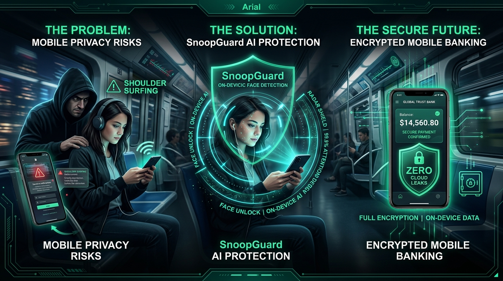
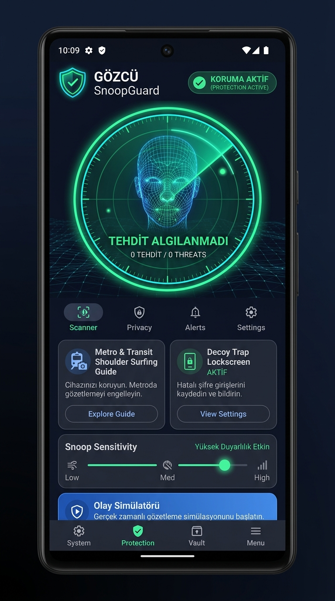
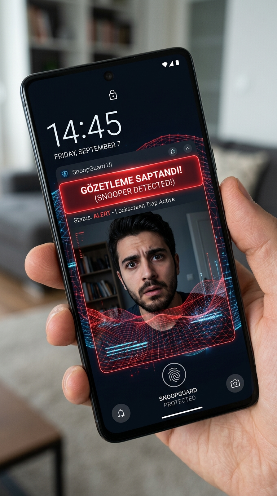
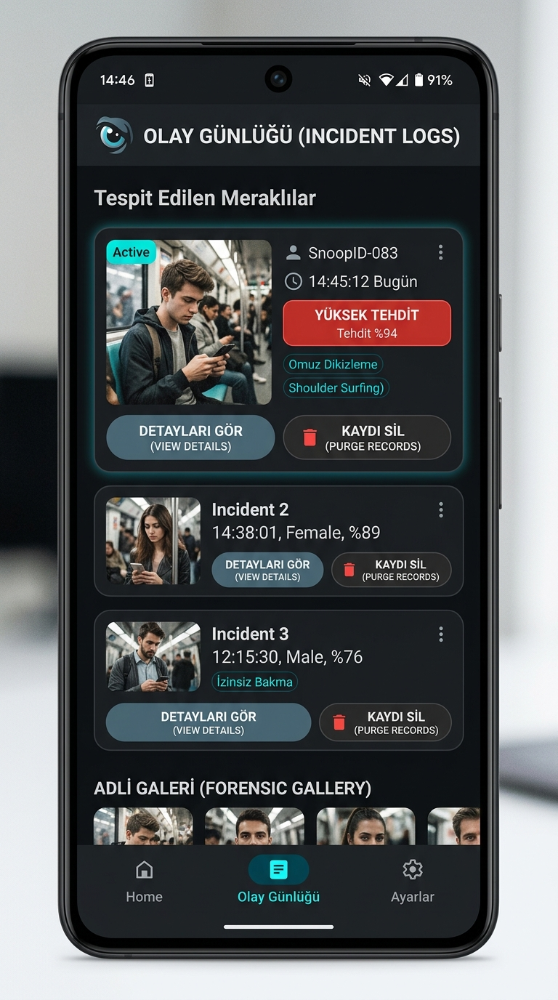

# 🛡️ SnoopGuard (Gözcü)
> **On-Device AI Privacy Shield against Shoulder Surfing & Unattended Phone Snooping**

[](https://kotlinlang.org)
[](https://developer.android.com/jetpack/compose)
[](https://developer.android.com)
[](https://developer.android.com)
[-FF6D00.svg?style=for-the-badge&logo=android)](snoopguard.apk)

<p align="center">
  
</p>

---

## 📸 App Screenshots

<p align="center">
  
  &nbsp;&nbsp;
  
  &nbsp;&nbsp;
  
</p>

<p align="center">
  <i>1. <b>Live Shield Dashboard:</b> Real-time biometric radar & threat scanner</i> • 
  <i>2. <b>Decoy Trap:</b> Stealth lockscreen & silent intrusion photo trigger</i> • 
  <i>3. <b>Forensic Gallery:</b> Timestamped intruder evidence log</i>
</p>

---

## 📥 Download Ready-to-Install APK

You can directly download and test the compiled Android package or attach it to your **GitHub Releases**:

* 📦 **Release Folder:** [`releases/tag/v.0.0.1`](snoopguard.apk)
* 🚀 **GitHub Releases Tag:** `v1.0.0`
* 📱 **Minimum OS Requirement:** Android 8.0+ (API 26+)
* 🔐 **Permissions:** Camera (100% Optional & On-Device), Vibration, Local Storage

> **How to create GitHub Release with this APK:**
> 1. In your GitHub repository, click on **Releases** -> **Create a new release** (or **Draft a new release**).
> 2. Set tag version to `v1.0.0` and title to `SnoopGuard v1.0.0 Initial Release`.
> 3. Under **Attach binaries by dropping them here**, drag and drop `snoopguard.apk` (or `release/snoopguard-v1.0.0-release.apk`).
> 4. Click **Publish release**. Done! Users can now download the APK directly from your GitHub Releases page.

---

## 📌 Real-World Problems SnoopGuard Solves

Smartphones contain our most private assets: **mobile banking, biometric credentials, sensitive family chats, private photos, and enterprise communications**. However, in public or shared spaces, screen privacy is consistently compromised.

### 1. The "Shoulder Surfing" Dilemma in Public Transit & Cafes
* **The Scenario:** You are checking your crypto wallet, mobile banking balance, or reading intimate messages on the subway, bus, plane, or in a busy cafe. Strangers standing behind or sitting next to you gaze at your screen unnoticed.
* **The Danger:** More than 70% of credential leaks in public occur due to visual hacking (shoulder surfing). Most users are forced to awkwardly cup their screens with their hands.
* **SnoopGuard Solution (Live Shield):** Using front-camera gaze analysis, the local on-device neural engine detects foreign faces looking directly at your screen. The moment an unauthorized gaze crosses the threshold, SnoopGuard delivers a discreet vibration alert, highlights the intrusion with a red threat perimeter, and takes a silent snapshot of the intruder for forensic review.

---

### 2. Unattended Phone Snooping at Desks & Offices
* **The Scenario:** You leave your phone on an office desk, conference table, study room, or at home while stepping away for coffee or a break. Curious colleagues or acquaintances attempt to wake the screen or inspect incoming notification previews.
* **The Danger:** Unauthorized reading of personal notifications, confidential Slack/WhatsApp messages, or passcode guessing attempts.
* **SnoopGuard Solution (Decoy Trap Screen):** Activates an ultra-realistic fake lockscreen showing real-time clock, date, and modern lock indicators. As soon as unauthorized fingers touch the screen, SnoopGuard captures an immediate silent, flash-free snapshot via the front camera and logs the intrusion with timestamp down to the second. Exit is strictly guarded by the owner's PIN.

---

### 3. Biometric Cloud Anxiety & Data Harvesting
* **The Scenario:** Existing security apps frequently upload camera snapshots and facial vectors to remote cloud servers, creating grave surveillance and data leakage hazards.
* **SnoopGuard Solution (100% On-Device Zero-Cloud Architecture):** Every face landmark comparison, image storage, and threat calculation is conducted strictly inside the device's hardware using **Android Jetpack Room SQLite**. No telemetry, no third-party SDKs, and zero internet upload.

---

### 4. Legal Compliance & Explicit Consent
* **The Principle:** Respecting personal rights and privacy laws.
* **SnoopGuard Solution:** SnoopGuard incorporates a mandatory **Disclaimer & Explicit Consent Protocol**. Camera access is completely optional; users can test and evaluate all features safely using the built-in Threat Simulator without granting camera permissions.

---

## 📱 App Architecture & User Journey

```
+-----------------------------------------------------------------------------------+
|                                 SNOOPGUARD                                        |
|                                                                                   |
|  [🛡️ Active Shield]               [📸 Incident Forensics]          [⚙️ Settings]  |
+-----------------------------------------------------------------------------------+
|                                                                                   |
|  1. SHIELD DASHBOARD (Home Screen)                                                |
|  +-----------------------------------------------------------------------------+  |
|  |  • Master Defense Toggle (Active / Standby)                                 |  |
|  |  • Real-Time Threat Status Badge (Safe Green / Breach Red)                  |  |
|  |  • Biometric Profile: Registered Owner vs Unknown Gaze                      |  |
|  |  • Problem Solver Guide: Real-life scenarios with visual illustrations       |  |
|  |  • Dual Protection Modes: Live Look Guard & Decoy Trap                      |  |
|  |  • Built-in Incident Simulator (Zero-camera hardware test mode)             |  |
|  +-----------------------------------------------------------------------------+  |
|                                                                                   |
|  2. DECOY TRAP (Stealth Trap Screen)                                              |
|  +-----------------------------------------------------------------------------+  |
|  |  • Hyper-realistic Lock Interface (14:45 | Friday, Sept 7)                  |  |
|  |  • Invisible Trigger: Touch -> Silent Front Camera Snapshot                  |  |
|  |  • Secure Passcode Exit to prevent snooper tampering                       |  |
|  +-----------------------------------------------------------------------------+  |
|                                                                                   |
|  3. FORENSICS LOG GALLERY                                                         |
|  +-----------------------------------------------------------------------------+  |
|  |  • High-Resolution Intruder Snapshots with Gaze Vectors                     |  |
|  |  • Detailed Metadata: Timestamp, Incident Type, Threat Confidence (e.g. 94%)|  |
|  |  • One-Tap Deletion & Total Secure Purge Capabilities                       |  |
|  +-----------------------------------------------------------------------------+  |
+-----------------------------------------------------------------------------------+
```

---

## ⚡ Core Features & Capabilities

| Capability | Engineering & User Benefit |
| :--- | :--- |
| **Real-Time Live Shield** | Monitors front-facing field of view to verify whether the active gazer matches the registered owner. |
| **Gaze Vector & Shoulder Alert** | Instantly detects peripheral look-ins from behind or sideways with haptic feedback. |
| **Decoy Trap Screen** | Deploys a realistic lockscreen while phone is unattended; silently photographs intruders. |
| **Owner Biometric Registration** | Calibrates baseline facial coordinates locally to prevent false alarms. |
| **Visual Guide & Scenarios** | Built-in interactive modal breaking down transit, desk, and cloud risks with custom graphics. |
| **Zero-Cloud Guarantee** | 100% offline functionality. Encrypted Room SQLite local database storage. |
| **Configurable Sensitivity** | Threshold slider (0.1 - 1.0), customizable haptic patterns, and alert audio settings. |

---

## 🛠️ Technology Stack

* **Language:** Kotlin 2.0 (Type-safe coroutines & Flow architecture)
* **UI Framework:** Jetpack Compose with Material Design 3 (M3 Cyberpunk Dark & Emerald Security Theme)
* **Architecture:** MVVM + Clean Architecture with `StateFlow` and unidirectional data flow
* **Local Persistence:** Android Jetpack Room SQLite + KSP (Kotlin Symbol Processing)
* **Vision & Camera:** Android CameraX & Accompanist Dynamic Runtime Permissions
* **Visual Assets:** Custom high-fidelity illustrations (`img_privacy_hero`, `img_shoulder_surfing`, `snoop_guard_icon`)

---

## 🏗️ Build & Setup Instructions

### Prerequisites
* Android Studio Iguana / Jellyfish / Ladybug or Gradle 8.x
* JDK 17
* Min SDK: 26 (Android 8.0 Oreo) | Target SDK: 34 (Android 14)

### Building from Source
```bash
# Clone repository
git clone https://github.com/your-username/snoopguard-android.git
cd snoopguard-android

# Build Debug APK
gradle assembleDebug

# Run Robolectric Unit & Visual Tests
gradle :app:testDebugUnitTest
```

---

## 🔒 Privacy, Ethics & Legal Compliance

1. **Intended Use:** SnoopGuard is crafted strictly for personal device protection and anti-shoulder surfing deterrence.
2. **Local Processing:** All biometric vectors and captured photographs remain inside the sandboxed local application storage. No external servers or telemetry are utilized.
3. **User Consent:** First-run onboarding mandates review of the legal disclaimer. Users can revoke consent and purge all biometric registries at any time via Settings.

---

<p align="center">
  <b>SnoopGuard</b> • Your Screen Is For Your Eyes Only.
</p>
